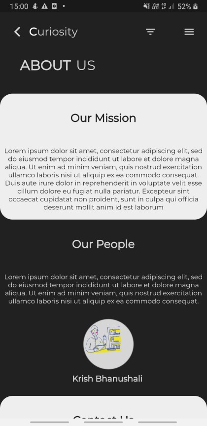
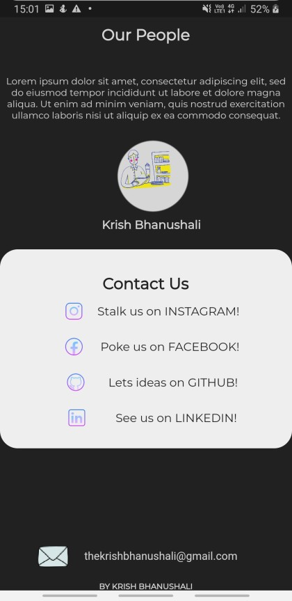

# About Us Page template

A new Flutter application which is just a about us scrollable template.

# Introduction

Now again I made this one from scratch , tried for a minimalist design not perfect but yes this can be later useful for the main apps I will make , what will I do in further versions of this is 
- make the icons in the top bar working , that is a nav bar and provide other routes
- improve UI align everything properly especially the contact us container
- Adding real address to contacts i.e opening a pop up as I learn further
- add shadows 
- planning to go for colorful designs after this and light theme too

# What Did I learnt 
Okay so I know professional readme's are totally different, after I complete everything I will remodify every readme.
- Okay I learnt to have a scrollable page
- how to remove the debug banner
- played with containers, paddings
- used to the dark theme
Though I need to learn layouts and study containers, paddings, rows , columns more 

# Visuals

## Getting Started

This project is a starting point for a Flutter application.

A few resources to get you started if this is your first Flutter project:

- [Lab: Write your first Flutter app](https://flutter.dev/docs/get-started/codelab)
- [Cookbook: Useful Flutter samples](https://flutter.dev/docs/cookbook)

For help getting started with Flutter, view our
[online documentation](https://flutter.dev/docs), which offers tutorials,
samples, guidance on mobile development, and a full API reference.
